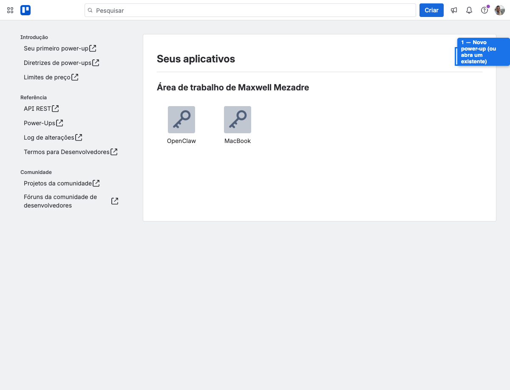
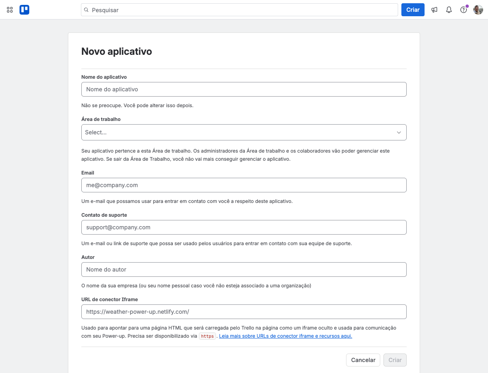
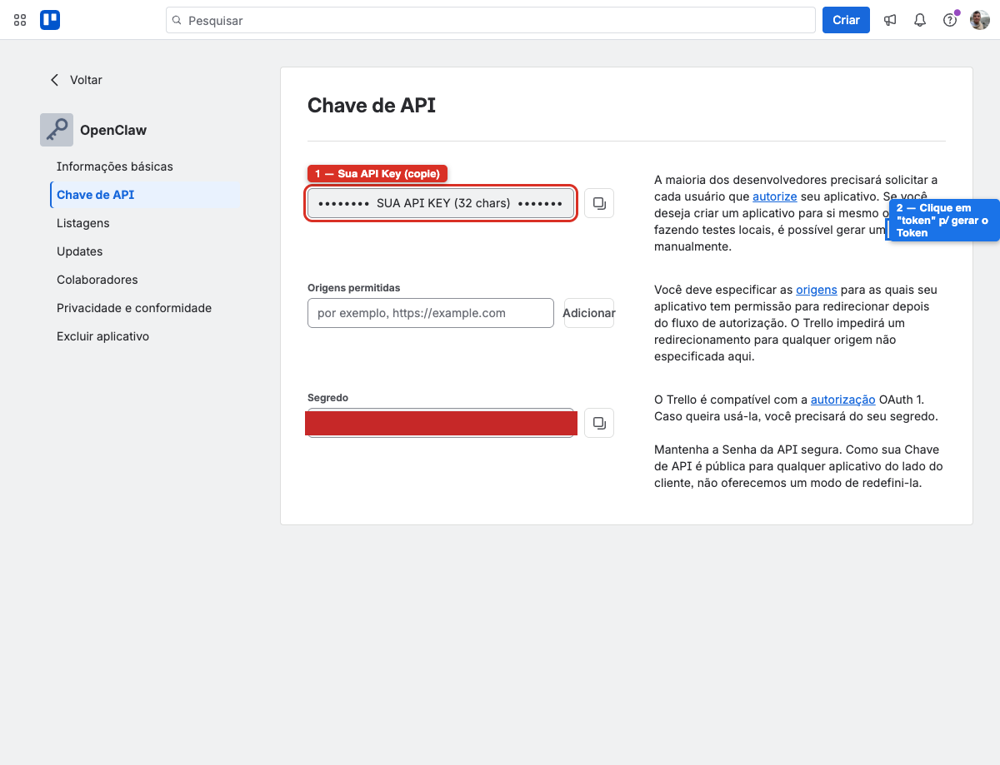
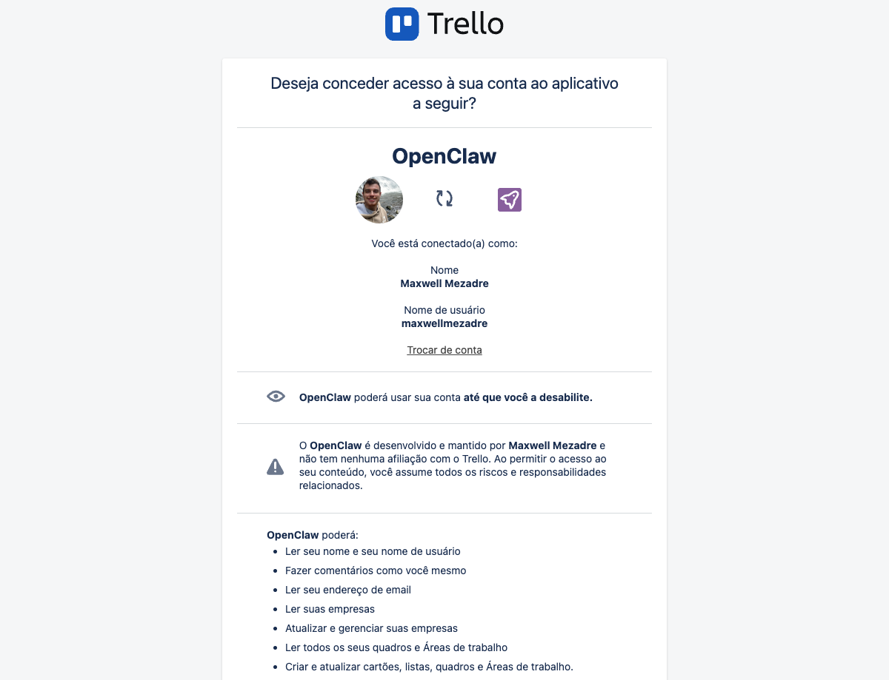
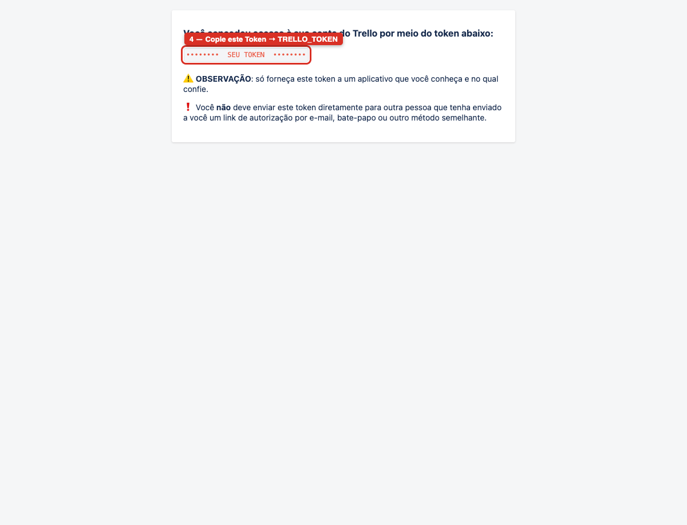

# Como gerar sua API Key e Token do Trello

Passo a passo com telas reais. O `trello-cli` precisa de duas coisas:

- **`TRELLO_API_KEY`** — identifica o aplicativo.
- **`TRELLO_TOKEN`** — autoriza o acesso à **sua** conta (leitura e escrita).

Leva ~2 minutos. Você precisa estar **logado no Trello** (<https://trello.com>).

> As imagens abaixo estão com a key, o segredo e o token **borrados de
> propósito** — os seus aparecerão preenchidos.

---

## Passo 1 — Abra o painel de Power-Ups

Acesse **<https://trello.com/power-ups/admin>**.

Clique em **Novo** para criar um aplicativo (ou abra um que você já tenha). Um
aplicativo é só o "container" que carrega sua API Key.



Ao criar um novo, dê um **Nome** (ex. `trello-cli`), escolha uma **Área de
trabalho** e confirme:



---

## Passo 2 — Copie a API Key e clique em "token"

No aplicativo, abra a aba **Chave de API** (menu à esquerda).

1. **① Copie a API Key** (32 caracteres) → será o seu `TRELLO_API_KEY`.
2. **② Clique no link "token"** (no texto à direita) para gerar o token.



> O campo **Segredo** (borrado na imagem) **não é usado** por esta ferramenta —
> ignore. Só precisamos da API Key e do Token.

---

## Passo 3 — Autorize o acesso

Abre a tela de autorização. Confira que está logado na sua conta e clique em
**Permitir**.



---

## Passo 4 — Copie o Token

A próxima tela mostra o seu **token**. **④ Copie-o** → será o seu
`TRELLO_TOKEN`.



---

## Passo 5 — Use no trello-cli

No terminal, exporte as duas variáveis e teste:

```sh
export TRELLO_API_KEY="cole-sua-api-key-aqui"
export TRELLO_TOKEN="cole-seu-token-aqui"

trello boards          # deve listar seus boards
```

Para o servidor MCP (Claude Desktop / Code), coloque as duas em `env` na config
(veja o [README](../README.md#uso--mcp)).

---

## ⚠️ Segurança

- O **token** dá acesso de **leitura e escrita** à sua conta Trello. Trate como
  senha: **nunca** faça commit dele, não cole em chats, não compartilhe.
- Prefira variáveis de ambiente (como acima) ou a config do MCP — nunca deixe
  no código.
- **Revogar** um token: acesse **<https://trello.com/my/account>** →
  role até **Aplicativos** (Applications) → remova o token, **ou** desabilite o
  aplicativo correspondente em <https://trello.com/power-ups/admin> (isso
  invalida os tokens dele).
- Gere um token novo a qualquer momento repetindo o Passo 2.
